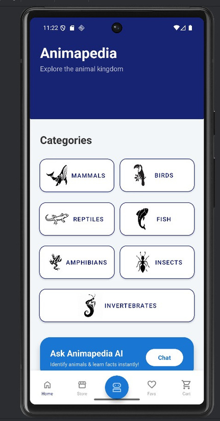
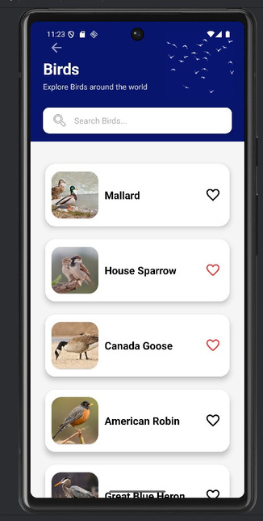
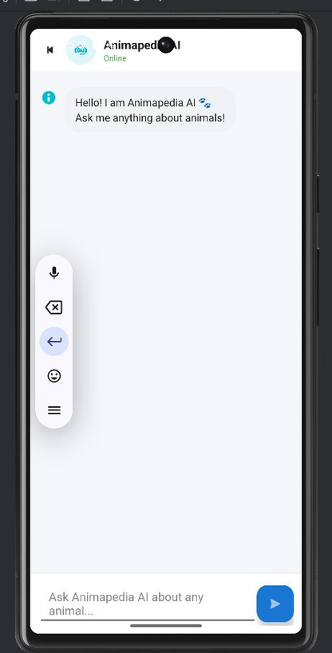
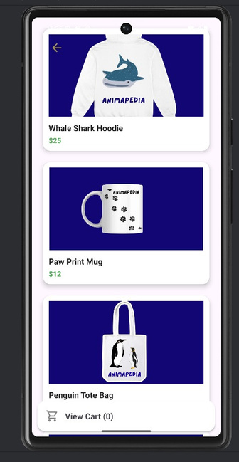

# Animapedia

Animapedia is an educational Android app that helps users explore and learn about animals in a simple and enjoyable way.

## What it does

- Search for animals and get instant results
- View animal details — image, name, and a short description
- Browse animals by category (mammals, amphibians, reptiles, insects, and more)
- Save animals to a favorites list for quick access
- Ask an AI chatbot questions about animals
- Browse and buy animal-themed merchandise

## Tech stack

Built with Android Studio (Java). Firebase handles user accounts, favorites, and order details. Animal data (images and descriptions) comes from the iNaturalist API.

## How it works

**Login / Register** — sign in or create an account, then land on the Home Screen

 

**Home Screen** — jump into categories, the AI chatbot, or the merch store

**Category & Animal Details** — browse or search animals within a category, tap one to see its details, and add it to favorites

 

**AI(RAG) Chatbot** — ask animal-related questions and get conversational answers

**Merch Store & Checkout** — browse animal-themed products, add to cart, and check out

 

**Favorites** — revisit saved animals anytime

## Future improvements

- Animal sounds, videos, and 3D models
- Multi-language support
- Habitat maps and interactive learning tools

